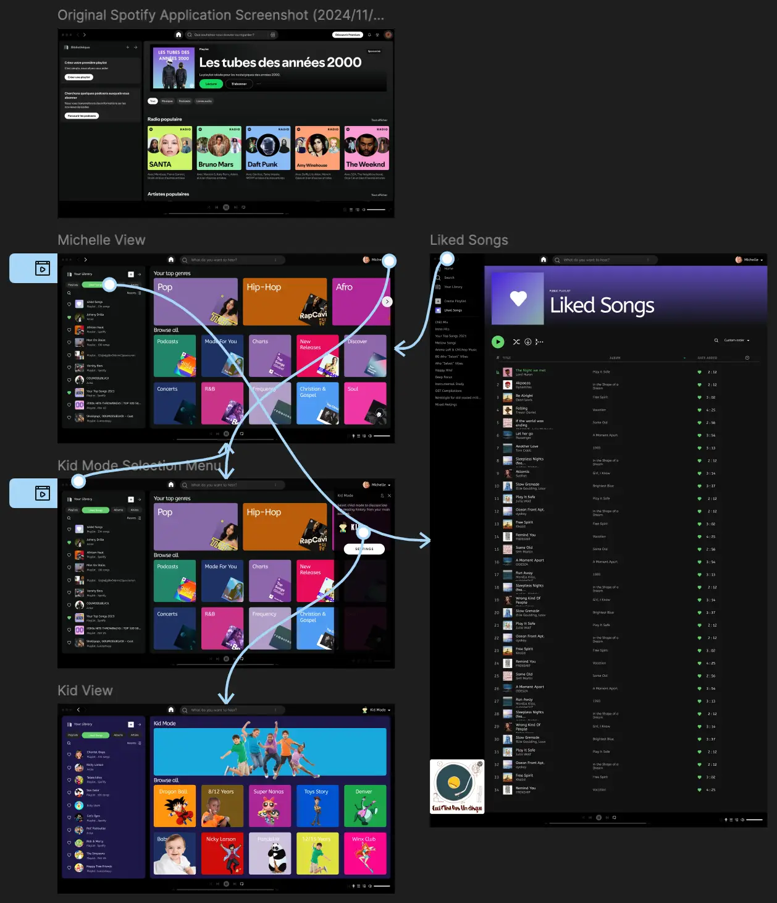

# Designer language

## Table of contents

    

        CLICK TO ENLARGE 😇
    

    <a href="#description">Description</a>
     
    <a href="#objectives">Objectives</a>
     
    <a href="#requirements">Requirements</a>
     
    <a href="#instructions">Instructions</a>
     
    <a href="#tech-stack">Tech stack</a>
     
    <a href="#files-description">Files description</a>
     
    <a href="#installation_and_how_to_use">Installation and how to use</a>
     
    <a href="#thanks">Thanks</a>
     
    <a href="#authors">Authors</a>

## Description

This project explores the work of UI/UX designers by simulating the design process applied to a real problem:
- How to improve how Spotify users discover music.

The project was carried out in three phases:
1. Research: empathize with users, analyze their journey, identify frustrations, and brainstorm opportunities.  
2. Prototype: create high-fidelity mockups in Figma and make them interactive.  
3. Validation: conduct usability testing to confirm the solutions’ relevance and refine them.

## Objectives

At the end of this project, I should be able to explain to anyone, **without the help of Google**:

- The role and responsibilities of a designer.  
- How designers collaborate with teams and communicate needs.  
- How to conduct a UX case study from research to prototype.  
- How to propose improvements supported by user journeys and personas.  

## Requirements
 
- Follow the UX case study template provided.  
- Include sketches, notes, and prototypes.  
- Publish the final case study as a blog post on GitHub, LinkedIn or Medium.  
- Use Figma to produce interactive prototypes.  

## Instructions

### Mandatory

    

        <b>0. Empathize & define opportunities for improvement</b>
    

     

With this first assignment, you are trying to understand who you are designing for and how you can make their experience more delightful or reduce the friction. To achieve this, you need to set aside your assumptions. You are not the user, you cannot anticipate their behavior and needs. And from this experience, you can define where/when there is room for improvement without being distracted by your gut feelings.

- Read the personas from above, choose one of them.
- Read their user journey map.
- Assuming you are this person, follow and reproduce each step of their journey.
- Make a list of all the opportunities for improving this experience.

**Things you should have collected:**

- The persona and user journey map you have chosen.
- A list of opportunities for improvements.

**Post only blog post here for all tasks.**

#
**Repo:**
- GitHub repository: `holbertonschool-designer_language`.

    

        <b>1. Sketch: challenge assumptions and generate ideas</b>
    

     

Based on what you have learned from the first task, you will now generate as many ideas as you can. Good or bad, you want them ALL.

You are now in a brainstorming mode: think outside the box. Have you thought about the worst possible idea? Sketch it as well.

Don’t aim for perfect sketches, aim for ideas in quantity. Draw by hand, on a whiteboard or on paper. Remember to take a photo of each idea.

**Things you should have collected:**

- Photos of your sketched ideas.

#
**Repo:**
- GitHub repository: `holbertonschool-designer_language`.

    

        <b>2. Decide: choose the idea to elaborate</b>
    

     

Gather in groups based on the persona you have chosen. Everyone should present their ideas and the group should help you to choose the best idea to explore in the next phase.

- As the speaker, briefly pitch the opportunities you have found from the user’s journey and show your sketched ideas.
- As a reviewer, if you think your peer has made an assumption, question it.
    - Example: If you hear “The user will right-click on the song and […]”, ask “Will the user know that they should right-click?”.

**Things you should have collected:**

- Photo of chosen solution.
- Text explaining: “Why did you and your team choose to explore this idea over the other ones?”.
- There are no bad ideas: list all initials ideas with pros/cons for each that make you or your team decide which way you want to take.

#
**Repo:**
- GitHub repository: `holbertonschool-designer_language`.

    

        <b>3. Prototype: make your solution real enough</b>
    

     

In order to validate your solution, you need to produce a prototype that looks like the real product.

- First, you will need to storyboard your solution.
    - Sketch the user flow on a whiteboard or on paper.
    - Take a photo.
- Then, design the high-fidelity mockups in Figma.
    - If you are not familiar with Figma, [take a quick tour of the interface](https://help.figma.com/hc/fr/categories/360002051613-Getting-Started#Take-a-Tour).
- And finally, pull them together to make your prototype interactive (clickable).
    - [Learn about prototyping with Figma](https://help.figma.com/hc/fr/articles/360040314193-Guide-de-prototypage-dans-Figma).

**Things you should have collected:**

- Storyboard of user flow (photo of whiteboard or sketches)
- The link to view your “pixel-perfect” mockups
- The link to access the interactive prototype on Figma

Please submit a link to a blog post (on Medium or by using a Google Doc, if you don’t want to make it public). In the blog post you should include the images of your mockups as well as your Figma design. Talk the audience through your design process and where you finally landed in your design!

To not start from scratch, you can reuse the [initial Spotify file](https://www.figma.com/file/7aHq0Tns4c6CZDALLd1RXn/Spotify) that [Juno - C#8](https://twitter.com/x/migrate?tok=eyJlIjoiL2p1bWljYXRlcyIsInQiOjE3MTU5NjIyMjV9axyKCj8BNbPnZ21UTZK14A%3D%3D) made, duplicate it and enjoy!

#
**Repo:**
- GitHub repository: `holbertonschool-designer_language`.

## Tech stack

    
    
    
    
    

## Files description

| **FILES**     | **DESCRIPTION**                                     |
| :-----------: | --------------------------------------------------- |
| `assets`      | Contains the resources required for the repository. |
| `research.md` | Full UX case study (research + prototype).          |
| `README.md`   | The README file you are currently reading 😉.      |

## Installation and how to use

### How to use:

1. Read the full UX research documentation [here](./research.md).

<table>
    <tr valign="top">
        <td align="center">
            <picture>
                <source media="(prefers-color-scheme: dark)" srcset="./assets/images/figma-spotify.webp">
                <source media="(prefers-color-scheme: light)" srcset="./assets/images/figma-spotify.webp">
                
            </picture>
        </td>
        <td align="center">
            <picture>
                <source media="(prefers-color-scheme: dark)" srcset="./assets/images/figma-spotify-mockups.webp">
                <source media="(prefers-color-scheme: light)" srcset="./assets/images/figma-spotify-mockups.webp">
                
            </picture>
        </td>
    </tr>
</table>

## Thanks

- A big thank you to all my Holberton School peers for their help and support throughout this project.

## Authors

**Fabien CHAVONET**
- GitHub: [@fchavonet](https://github.com/fchavonet)
