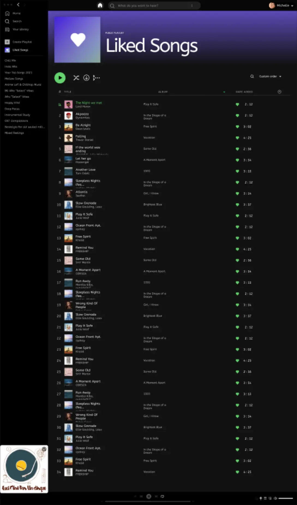

# Enhancing the Spotify user experience

As part of my training at Holberton School, I worked on a project aimed at improving the Spotify desktop app user experience. This project focused on understanding the role of a UX/UI designer and proposing concrete solutions to a specific user challenge.

## Project context

The goal was to enhance how users discover music on Spotify. To structure the work, we were provided with three personas, each representing a user profile with distinct needs and frustrations:

- **Alex:** a student looking for music to help him focus while studying.
- **Michelle:** a nurse practitioner wanting to explore new music genres.
- **Regina:** a retiree aiming to build a library of saved songs tailored to her tastes.

Each persona came with a detailed user journey map, highlighting their actions, thoughts, and pain points. 

## Why Michelle?

I chose Michelle as my persona because her challenges reflect common frustrations faced by users in family accounts.
 
She uses Spotify to unwind and discover new genres, but she faces several issues:

- **Skewed recommendations:** her kids' activity on the shared family account influences Spotify’s suggestions, making it harder for her to find music she enjoys.
- **Complex navigation:** Michelle struggles with the abundance of options in tabs like "Radio," "Genre & Moods," and "Discover," often feeling overwhelmed.
- **Saving discoveries:** When she finds a song or playlist she likes, Michelle doesn’t understand how to save it easily, which discourages her from exploring further.
- **Lack of personalization:** Spotify doesn’t offer her a dedicated space to explore and organize her discoveries without affecting the recommendations for other family members.

## Analysis and opportunities for improvement

By walking through Michelle’s user journey, I identified several opportunities to improve her experience:

- **Recommendations:** personalize recommendations based solely on Michelle’s activity, independent of her kids’ usage.
- **Simplified navigation:** reorganize categories to make the app easier to explore.
- **Saving songs:** introduce a clear and simple way to save music directly while browsing.
- **Dedicated space:** create a personal space where Michelle can manage her saved music without impacting family recommendations.

## Brainstorming solutions

Based on these insights, I brainstormed various ideas to address Michelle’s frustrations:

- **"Just for Me" mode:** a section where recommendations are tailored exclusively to Michelle’s preferences.
- **Personal library:** a dedicated space for saving and organizing favorite tracks and playlists.
- **Simplified navigation:** intuitive categories such as:
    - “Discover”
    - “Relaxation”
    - “Motivational Pop”
- **Guided assistant:** an interactive tutorial to help Michelle define her preferences and explore genres.
- **Advanced search filters:** add filters like “instrumental,” “upbeat,” or “calm” to refine music searches.
- **Contextual playlists:** curated playlists based on moods or moments, such as "End of Day," "Focus Time," or "Quiet Evening."
- **Visible favorites button:** a simple heart icon to save songs or playlists instantly.
- **Kids mode:** a separate, child-friendly space that prevents kids' activity from influencing Michelle’s recommendations.
- **Collaborative playlists:** a feature to create family playlists without affecting individual preferences.
- **Playlist duration filters:** allow users to sort playlists by duration.

## Selected ideas

After evaluating all the options, I decided to focus on two key solutions that directly address Michelle’s frustrations:

### 1. Liked button

A visible and intuitive way to save music discoveries:

- **Position:** a heart icon is placed next to each song or playlist, using a bold green color to make it stand out.

    

- **Functionality:** clicking the heart adds the item to a dedicated “Liked Songs” playlist.

    

- **Quick access:** the “Liked Songs” playlist is easily accessible from the library.

    

    

- **Impact on recommendations:** songs marked as favorites influence Spotify’s algorithm, offering Michelle personalized suggestions.

### 2. Kids Mode

A dedicated space for children to explore Spotify:

- **Easy access:** a "Kids Mode" button is prominently displayed in the main navigation bar for quick switching.

    

    

- **Environment:** a visually engaging, age-appropriate interface with vibrant colors and simplified navigation.

- **Simplified design:** navigation is tailored to children’s needs, ensuring an intuitive experience.

    

- **Independent recommendations:** kids’ activity in this mode does not affect the main account’s suggestions.

## Prototype links

To bring these ideas to life, I created mockups and an interactive prototype using Figma:

- View the [project](https://www.figma.com/design/in6gAXTGaDjRtClfRgI1C8/Spotify?node-id=0-1&t=5IB8s6VsFYOaKkSk-1) mockups
- Access the [interactive prototype](https://www.figma.com/proto/in6gAXTGaDjRtClfRgI1C8/Spotify?node-id=0-1&t=5IB8s6VsFYOaKkSk-1)

    

## Conclusion

These two features address Michelle’s specific frustrations:

- Kids Mode solves the issue of biased recommendations caused by her children’s activity.
- Favorites Button simplifies the process of saving music, encouraging her to explore more.

By creating a more personalized and intuitive experience, these solutions not only improve Michelle’s journey but also enhance Spotify’s usability for other family account users.

This project was a valuable opportunity to understand the UX design process and to propose thoughtful, user-centered improvements.

## Usability testing and validation

To validate the proposed solutions (*Kids Mode* and *Liked Button*), I conducted usability testing with five participants, simulating the perspective of potential Spotify users. The goal was to assess how easily users could interact with the prototype and identify any usability issues. Here's a summary of their experiences:

**Participant 1:**

- Task completion: successfully navigated to *Kids Mode* and used the *Liked Button*.
Feedback: found the *Kids Mode* button placement intuitive and the interface visually engaging. The heart icon for the *Liked Button* was clear but suggested adding a tooltip for first-time users.
- Observation: slight hesitation when exploring the *Kids Mode* settings but quickly adapted.

**Participant 2:**

- Task completion: successfully completed all tasks but struggled to locate the *Liked Songs* playlist at first.
- Feedback: appreciated the independence of *Kids Mode* recommendations.
- Observation: took a few extra seconds to notice the playlist under Library.

**Participant 3:**

- Task completion: partially successful. Located and used *Kids Mode* but misunderstood the function of the *Liked Button*, thinking it saved to a genre-specific folder.
- Feedback: suggested clearer onboarding for the *Liked Button* functionality and a confirmation message when saving songs.
- Observation: confusion stemmed from the assumption that the button had advanced sorting capabilities.

**Participant 4:**

- Task completion: successfully used both features without difficulty.
- Feedback: praised the *Kids Mode* design as intuitive and enjoyable for children. Found the *Liked Button* simple and effective.
- Observation: quickly grasped the concept and functionality, completing the tasks efficiently.

**Participant 5:**

- Task completion: successfully navigated the prototype but struggled with switching back from *Kids Mode* to the main account.
- Feedback: suggested adding a more prominent *Switch Back* option and integrating a brief tutorial for new features.
- Observation: enjoyed the features overall but highlighted the need for clearer visual cues during transitions.

## Conclusion and next steps

**Successes:**
- Both features were well-received, with most participants finding them intuitive and addressing key user frustrations.
- *Kids Mode* was especially praised for its independence from family recommendations and its kid-friendly design.
- The *Liked Button* effectively simplified music saving for most users.

**Improvements:**
- Add an interactive tutorial for *Kids Mode* to explain its features during first use.
- Add a *back to normal mode* button.
- Relocate the *Liked Songs* button to a more visible and accessible spot, like the sidebar or top of the Library section.
- Test the system and colors in light mode to ensure readability and consistency.

**Next Steps:**

- Implement minor design refinements based on participant feedback.
- Conduct a second round of testing to validate changes, focusing on users unfamiliar with Spotify.

This validation process provided valuable insights, confirming the viability of the proposed solutions while highlighting areas for improvement.